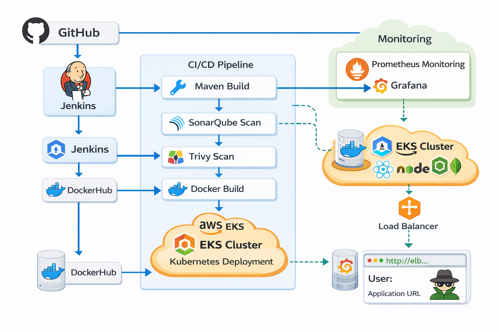
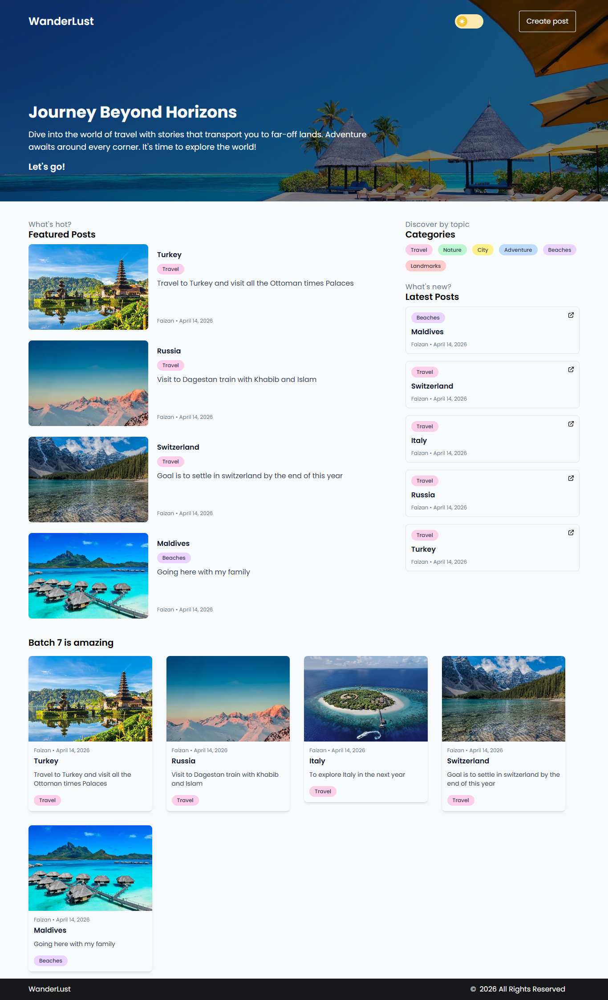
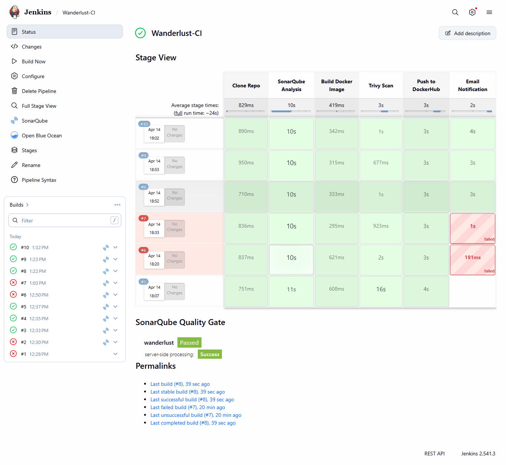
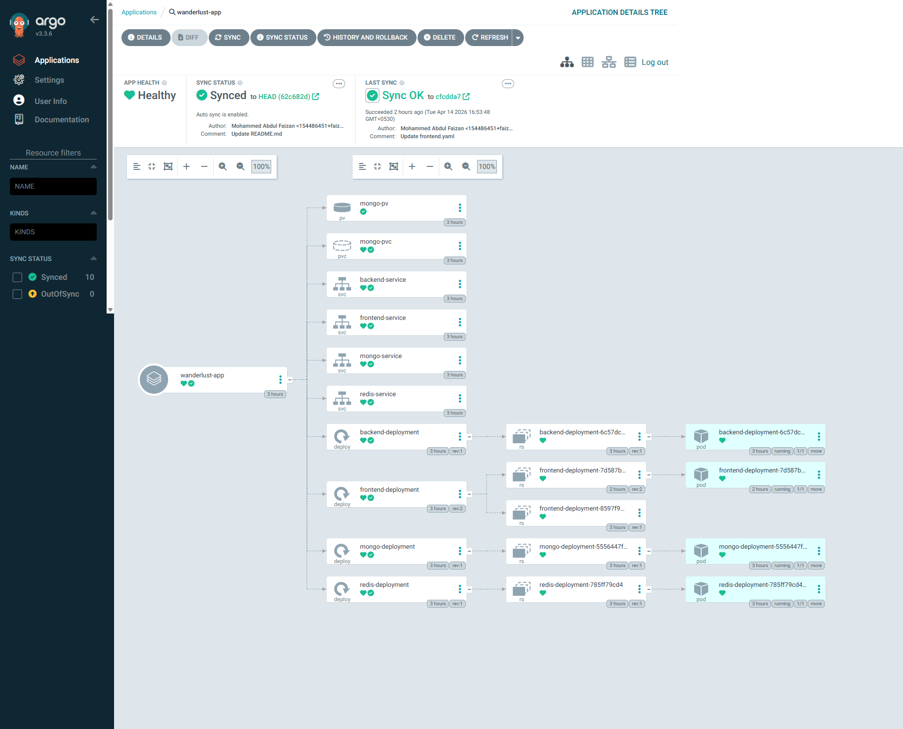
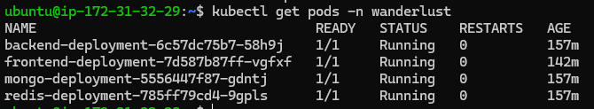
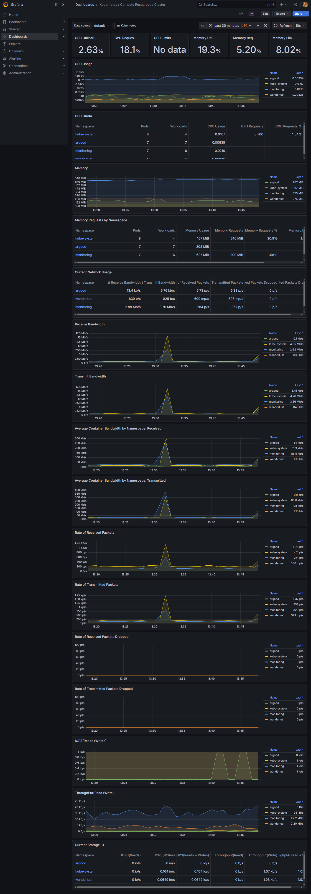
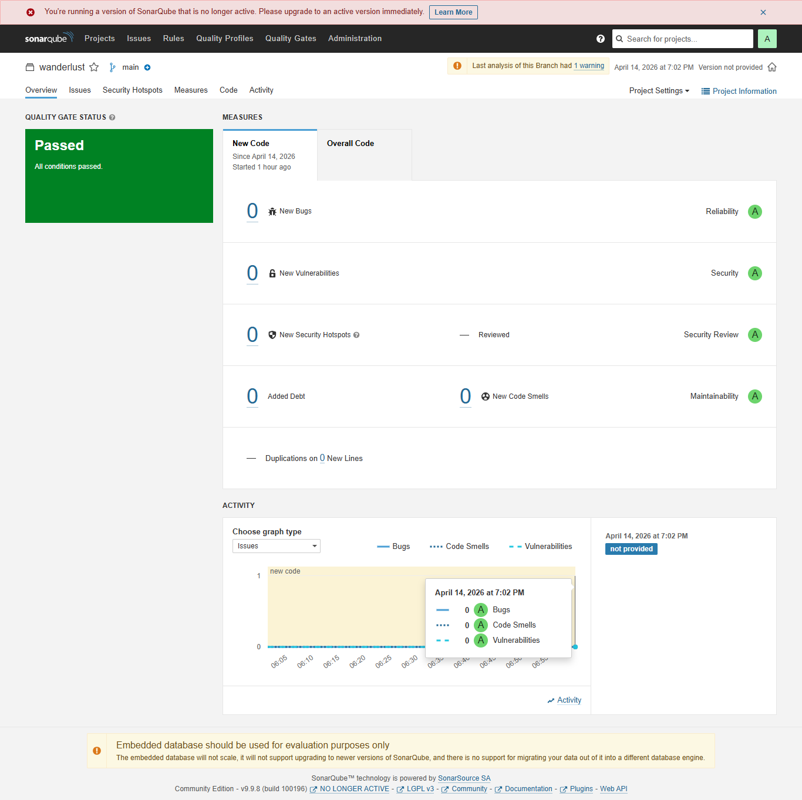

# 🚀 End-to-End DevSecOps CI/CD Pipeline on AWS EKS


---

## 📌 Overview

This project demonstrates a **production-grade DevSecOps pipeline** for deploying a MERN stack application on **AWS EKS (Kubernetes)** using modern CI/CD, security, and monitoring tools.

It automates the complete lifecycle from:

> **Code Commit → Build → Quality Check → Security Scan → Deployment → Monitoring → Alerts**

---

## 🏆 Project Highlights

* 🚀 Built a **GitOps-based deployment system using ArgoCD**
* 🔄 Automated CI pipeline using Jenkins
* 🔍 Integrated **SonarQube for code quality analysis**
* 🔐 Implemented **Trivy for container vulnerability scanning**
* ☁️ Deployed application on **AWS EKS cluster**
* 📊 Configured **Prometheus & Grafana for monitoring**
* 📧 Enabled **email notifications for pipeline status**
* 🛠️ Debugged real-world issues (service networking, API failures)

---

## 🏗️ Architecture

### 🔹 Architecture Diagram



### 🔹 Architecture Flow
```
                    ┌───────────────┐
                    │   Developer   │
                    └──────┬────────┘
                           │
                           ▼
                    ┌───────────────┐
                    │    GitHub     │
                    └──────┬────────┘
                           │ (Webhook Trigger)
                           ▼
                    ┌───────────────┐
                    │    Jenkins    │
                    │      (CI)     │
                    └──────┬────────┘
                           │
        ┌──────────────────┼──────────────────┐
        ▼                  ▼                  ▼
┌───────────────┐  ┌───────────────┐  ┌───────────────┐
│  SonarQube    │  │    Trivy      │  │   Docker      │
│ Code Analysis │  │ Security Scan │  │ Build Image   │
└──────┬────────┘  └──────┬────────┘  └──────┬────────┘
       │                  │                  │
       └──────────────┬───┴──────────────────┘
                      ▼
               ┌───────────────┐
               │  DockerHub    │
               │ (Image Repo)  │
               └──────┬────────┘
                      │
                      ▼
               ┌───────────────┐
               │    ArgoCD     │
               │   (GitOps)    │
               └──────┬────────┘
                      │
                      ▼
               ┌───────────────┐
               │   AWS EKS     │
               │ Kubernetes    │
               └──────┬────────┘
                      │
      ┌───────────────┼────────────────┐
      ▼                                ▼
┌───────────────┐              ┌───────────────┐
│   Frontend    │              │   Backend     │
│   (React)     │              │   (Node.js)   │
└───────────────┘              └──────┬────────┘
                                      ▼
                               ┌───────────────┐
                               │   MongoDB     │
                               └───────────────┘

                      ▼
        ┌───────────────────────────────┐
        │ Prometheus + Grafana          │
        │ Monitoring & Visualization    │
        └───────────────────────────────┘

                      ▼
              ┌───────────────┐
              │ Email Alerts  │
              └───────────────┘
```

---

## ⚙️ Tech Stack

### 🔹 Cloud & Infrastructure

* AWS EKS (Kubernetes)
* EC2 (Jenkins, SonarQube, Docker)

### 🔹 CI/CD

* Jenkins (Continuous Integration)
* ArgoCD (GitOps Continuous Delivery)

### 🔹 Containerization

* Docker
* DockerHub

### 🔹 Code Quality & Security

* SonarQube
* Trivy

### 🔹 Monitoring

* Prometheus
* Grafana

### 🔹 Application

* MERN Stack (MongoDB, Express, React, Node.js)

---

## 🔄 CI/CD Pipeline Workflow

1. Developer pushes code to GitHub
2. Jenkins pipeline triggers automatically
3. SonarQube performs static code analysis
4. Docker image is built
5. Trivy scans image for vulnerabilities
6. Image is pushed to DockerHub
7. ArgoCD syncs and deploys to EKS
8. Application becomes live
9. Metrics collected via Prometheus
10. Visualization via Grafana
11. Email notification sent

---

## 📂 Repository Structure

```
.
├── frontend/
├── backend/
├── Kubernetes/
│   ├── frontend.yaml
│   ├── backend.yaml
│   ├── mongo.yaml
├── Jenkinsfile
└── README.md
```

---

## 📸 Screenshots

### 🔹 Application Running



### 🔹 Jenkins Pipeline



### 🔹 ArgoCD Deployment



### 🔹 Kubernetes Pods



### 🔹 Grafana Monitoring



### 🔹 SonarQube Report



---

## 🛠️ Setup Guide (High-Level)

1. Create AWS EKS cluster using `eksctl`
2. Install ArgoCD in Kubernetes
3. Setup Jenkins on EC2
4. Configure Docker, SonarQube, Trivy
5. Connect GitHub repository
6. Create Jenkins pipeline
7. Deploy application via ArgoCD
8. Install monitoring stack using Helm

---

## 🧠 Key Learnings

* Implemented **end-to-end CI/CD automation**
* Understood **GitOps workflows**
* Gained hands-on with **Kubernetes production deployments**
* Integrated **security into DevOps pipeline (DevSecOps)**
* Debugged **real microservices communication issues**

---

## 🚀 Future Enhancements

* Add Ingress with custom domain & HTTPS
* Implement Helm charts
* Use LoadBalancer services
* Add Jenkins distributed agents
* Integrate Slack/MS Teams notifications

---

## 👨‍💻 Author

**Mohammed Abdul Faizan**
🚀 DevOps & Cloud Enthusiast

---

## ⭐ Support

If you found this useful, give it a ⭐ on GitHub!
